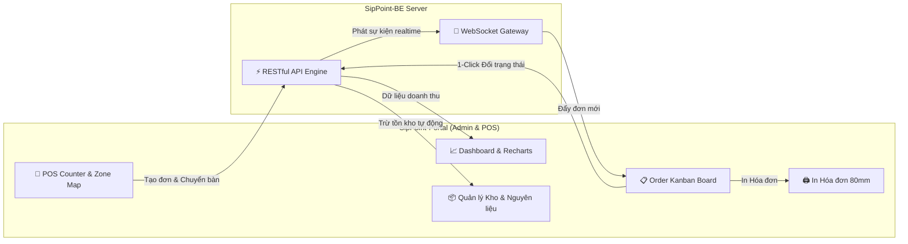

# 📊 SipPoint - Admin & POS Store Management Portal

[](https://react.dev/)
[](https://vitejs.dev/)
[](https://tailwindcss.com/)
[](https://ui.shadcn.com/)
[](https://reactrouter.com/)
[](https://recharts.org/)
[](https://sheetjs.com/)
[](https://vercel.com/)

**SipPoint-Portal** là Hệ thống Quản trị & Vận hành Cửa hàng toàn diện phục vụ cho Chủ chuỗi, Quản lý cửa hàng, Thu ngân và Nhân viên Pha chế của chuỗi **SipPoint Coffee & Tea**. Tích hợp màn hình POS bán hàng, quản lý đơn hàng Kanban thời gian thực, in hóa đơn nhiệt 80mm, quản lý kho nguyên liệu và CRM / Marketing tập trung.

---

## 🌐 1. Kiến trúc Vận hành & Luồng Xử lý Cửa hàng



---

## 🚀 2. Phân tích Chi tiết 25+ Phân hệ & Trang Quản trị

### 📈 2.1. Dashboard Realtime & Phân tích Doanh thu (`pages/dashboard`)
- **KPI Metrics tổng quan**: Thống kê doanh thu theo ngày, số lượng đơn hàng, số khách hàng mới và giá trị trung bình đơn (AOV).
- **Biểu đồ trực quan Recharts**:
  - Biểu đồ đường (Line chart) diễn biến doanh thu theo khung giờ trong ngày.
  - Biểu đồ cột (Bar chart) Top 5 sản phẩm bán chạy nhất.
  - Biểu đồ tròn (Pie chart) tỷ lệ phương thức thanh toán (`CASH` vs `TRANSFER`).

### 🛒 2.2. POS Thu ngân & Bảng Kanban Đơn hàng (`pages/orders`)
- **Màn hình POS Đặt món**:
  - Chọn sản phẩm, tùy biến Size (M/L) & Topping.
  - Áp mã voucher hoặc chiết khấu trực tiếp.
  - Gán khu vực / bàn ăn cho đơn ăn tại chỗ (`DINE_IN`).
- **Bảng Kanban Đơn hàng Real-time**:
  - Theo dõi đơn hàng theo 5 cột trạng thái: `PENDING` ➔ `CONFIRMED` ➔ `PREPARING` ➔ `READY` ➔ `COMPLETED`.
  - Cập nhật tức thì đơn mới từ Customer App qua Socket.io kèm âm thanh thông báo.
  - Chuyển trạng thái đơn 1-click drag & drop hoặc nút bấm.
- **In Hóa đơn Nhiệt 80mm**: Tích hợp định dạng hóa đơn nhiệt chuẩn 80mm (Layout in rõ ràng: Tên quán, Mã đơn, Tên món, Topping, Ghi chú, Tiền mặt/Chuyển khoản, Chân trang).

### 🗺️ 2.3. Sơ đồ Bàn & Khu vực (`pages/zones`, `pages/tables`)
- **Quản lý Khu vực (Zones)**: Thêm/sửa/xóa các khu vực (Tầng 1, Tầng 2, Sân thượng, Sân vườn...).
- **Sơ đồ Bàn (Table Map)**: Cấu hình danh sách bàn, trạng thái bàn thời gian thực (`available` - Bàn trống, `occupied` - Đang có khách, `cleaning` - Cần dọn).

### ☕ 2.4. Thực đơn & Tồn kho Nguyên liệu (`pages/menu`, `pages/categories`, `pages/inventory`)
- **Quản lý Thực đơn (Catalog)**: Thêm/Sửa/Xóa sản phẩm, cập nhật giá bán, hình ảnh đại diện, danh mục sản phẩm.
- **Biến thể Size & Toppings**: Cấu hình giá điều chỉnh cho Size M/L và các loại Topping.
- **Quản lý Nguyên liệu (Materials Inventory)**:
  - Khai báo danh mục nguyên liệu (Cà phê hạt, Sữa tươi, Trà, Đường, Ly nhựa...).
  - Thiết lập công thức định lượng nguyên liệu cho từng sản phẩm.
  - Cảnh báo tồn kho an toàn: Tự động đánh dấu `LOW` hoặc `OUT_OF_STOCK` khi lượng tồn kho chạm ngưỡng.

### 🎯 2.5. Marketing, Khuyến mãi & CRM (`pages/promotions`, `pages/campaigns`, `pages/customers`, `pages/segments`, `pages/luckyWheel`)
- **Chương trình Khuyến mãi & Voucher**: Tạo mã giảm giá theo phần trăm (%) hoặc số tiền cố định, giới hạn lượt dùng và giá trị đơn tối thiểu.
- **Banner Quảng cáo (`pages/banners`)**: Đăng tải banner sự kiện hiển thị trên Customer App.
- **Quản lý Khách hàng (CRM)**: Tra cứu lịch sử mua hàng, tổng chi tiêu, tích điểm SipPoints và cấp hạng thẻ (Đồng, Bạc, Vàng, Kim Cương).
- **Phân khúc Khách hàng Tự động (`pages/segments`)**: Gom nhóm khách hàng tự động theo tần suất mua và mức chi tiêu để chạy chiến dịch Marketing target.
- **Cấu hình Trò chơi May mắn (`pages/luckyWheel`)**: Thiết lập các ô phần thưởng và tỷ lệ trúng thưởng (%) cho Vòng quay may mắn.

### 👥 2.6. Nhân viên & Phân quyền RBAC (`pages/staff`, `pages/roles`)
- **Quản lý Tài khoản Nhân viên**: Tạo tài khoản cho nhân viên thu ngân, pha chế, phục vụ.
- **Phân quyền theo Vai trò (RBAC)**: Phân quyền truy cập theo vai trò (`ADMIN`, `MANAGER`, `CASHIER`, `BARISTA`, `STAFF`), kiểm soát chặt chẽ quyền xem/sửa/xóa.

### 📑 2.7. Ca làm việc, Nhật ký & Báo cáo Excel (`pages/activityLogs`, `pages/reports`, `pages/shifts`, `pages/transactions`)
- **Quản lý Ca làm (Shift Management)**: Khởi tạo ca, nhập số tiền két ban đầu, chốt két cuối ca, thống kê tổng tiền mặt và tiền chuyển khoản thu được.
- **Nhật ký Hoạt động (Activity Logs)**: Ghi lại toàn bộ thao tác hệ thống của nhân viên (tạo đơn, hủy đơn, sửa giá, chốt ca...).
- **Báo cáo & Xuất file Excel (SheetJS / XLSX)**: Xuất báo cáo doanh thu, lịch sử đơn hàng, dữ liệu ca làm ra file Excel `.xlsx` chỉ với 1 click.

---

## 📁 3. Cấu trúc Cây Thư mục Dự án

```
SipPoint-Portal/
├── public/                 # Static assets, Favicon, Logos
├── src/
│   ├── apis/               # Axios REST API Clients (auth, orders, products, analytics...)
│   ├── assets/             # Media, Brand Logos, Icons
│   ├── components/         # Shared UI Components (Sidebar, Header, Tables, Dialogs)
│   ├── constants/          # App Constants, ENUMs, Route Paths
│   ├── contexts/           # React Context Providers
│   ├── helpers/            # Utilities (Currency format, Date format, Thermal Print Helper)
│   ├── hooks/              # Custom React Hooks
│   ├── lib/                # Tailwind merge & clsx utilities
│   ├── pages/              # 25+ Trang Quản trị & POS Modules
│   │   ├── activityLogs/   # Nhật ký hoạt động nhân viên
│   │   ├── auth/           # Đăng nhập Portal
│   │   ├── banners/        # Quản lý Banner quảng cáo
│   │   ├── campaigns/      # Chiến dịch Marketing
│   │   ├── categories/     # Danh mục sản phẩm
│   │   ├── customers/      # CRM & Quản lý Khách hàng
│   │   ├── dashboard/      # Realtime Analytics Dashboard
│   │   ├── inventory/      # Quản lý Kho nguyên liệu & Công thức
│   │   ├── loyalty/        # Cấu hình Tích điểm & Hạng thẻ
│   │   ├── luckyWheel/     # Cấu hình Trò chơi Vòng quay may mắn
│   │   ├── menu/           # Quản lý Sản phẩm & Thực đơn
│   │   ├── notifications/  # Thông báo hệ thống
│   │   ├── orders/         # Màn hình POS & Kanban Đơn hàng
│   │   ├── payments/       # Quản lý giao dịch thanh toán
│   │   ├── profile/        # Hồ sơ tài khoản nhân viên
│   │   ├── promotions/     # Mã giảm giá Voucher
│   │   ├── reports/        # Báo cáo doanh thu & Xuất Excel
│   │   ├── reviews/        # Đánh giá của khách hàng
│   │   ├── roles/          # Phân quyền vai trò RBAC
│   │   ├── segments/       # Phân khúc khách hàng tự động
│   │   ├── settings/       # Cài đặt cửa hàng
│   │   ├── staff/          # Quản lý tài khoản Nhân viên
│   │   ├── tables/         # Quản lý danh sách Bàn
│   │   ├── transactions/   # Lịch sử biến động giao dịch SePay
│   │   └── zones/          # Quản lý Khu vực cửa hàng
│   ├── routes/             # Client Routing setup & Protected Route logic
│   ├── stores/             # Zustand State Stores (Auth, POS Store)
│   ├── App.jsx             # Main Application Component
│   ├── index.css           # Global Styles & Tailwind Imports
│   └── main.jsx            # Application Entry Point
├── .env                    # Cấu hình biến môi trường
├── vercel.json             # Cấu hình Vercel SPA Routing Rewrites
├── vite.config.js          # Cấu hình Vite Builder
└── package.json            # Package Dependencies & Scripts
```

---

## 🛠️ 4. Công nghệ & Thư viện Sử dụng

- **Core Framework**: React 19, Vite 8 (JavaScript).
- **UI Design System**: TailwindCSS v4, Shadcn UI, Radix UI primitives, Lucide Icons.
- **Biểu đồ & Báo cáo**: **Recharts** (Visual data charts) & **SheetJS (xlsx)** (Xuất Excel).
- **State Management**: **Zustand** & **TanStack Query (React Query v5)**.
- **Real-time WebSockets**: Socket.io-client.
- **Notifications**: Sonner Toast.

---

## ⚙️ 5. Cấu hình Biến môi trường (`.env`)

Tạo file `.env` ở thư mục gốc:

```env
# URL API Backend Server (Local / Production)
VITE_APP_API_URL=http://localhost:5000
```

---

## 💻 6. Hướng dẫn Khởi chạy Môi trường Local

### 1. Cài đặt Dependencies
```bash
npm install
```

### 2. Chạy Môi trường Development
```bash
npm run dev
```
Trình duyệt sẽ khởi chạy tại: `http://localhost:5173`.

---

## 🚀 7. Triển khai Production (Vercel)

Dự án đã tích hợp sẵn tệp cấu hình [vercel.json](file:///d:/Documents/FULLSTACK_MERN/SipPoint-Portal/vercel.json):

```json
{
  "rewrites": [
    { "source": "/(.*)", "destination": "/index.html" }
  ]
}
```

- **Build Command**: `npm run build`
- **Output Directory**: `dist`
- **Tác dụng**: Cấu hình rewrite này giúp chuyển hướng toàn bộ các đường dẫn như `/login`, `/dashboard`, `/orders` về `index.html`, triệt tiêu hoàn toàn lỗi **`404: NOT_FOUND`** khi reload (F5) hoặc truy cập trực tiếp trên Vercel.
